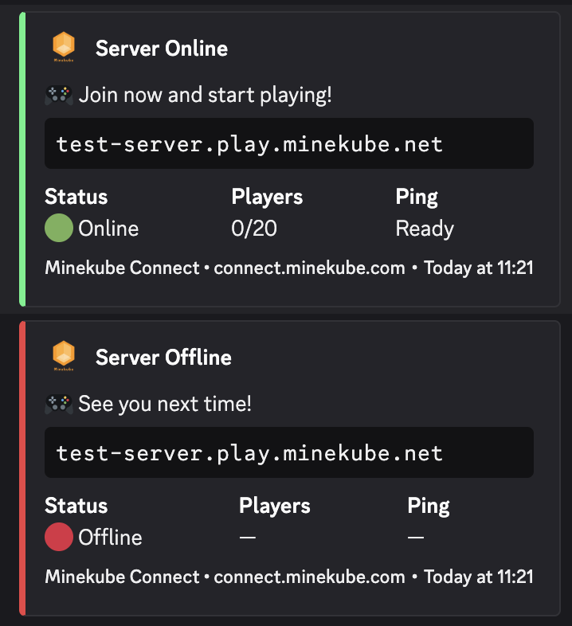

# Connect Notify

[](https://github.com/minekube/connect-notify/releases/latest)
[](https://github.com/minekube/connect-notify)

**Discord notifications for your Minekube Connect server status.**

<p align="center">
  
</p>

Let your friends know when your local Minecraft server is up and ready to join! This plugin sends a Discord webhook message when your server starts or stops, including the Connect endpoint so players can easily connect.

## Features

- 🟢 **Online notifications** – Sends a beautiful embed when your server starts
- 🔴 **Offline notifications** – Sends a message when your server stops
- 🔗 **Automatic endpoint** – Reads your endpoint from [Minekube Connect](https://connect.minekube.com) config
- 🎨 **Rich embeds** – Modern Discord embeds with status, players, and more
- 📢 **Multiple webhooks** – Notify multiple Discord channels or servers at once
- ⚡ **Simple config** – Just paste your Discord webhook URL and go!

## Supported Platforms

- ✅ Paper / Spigot / Bukkit (1.13+)
- ✅ Velocity
- ✅ BungeeCord / Waterfall

All platforms supported with a **single JAR file**.

## Requirements

- [Minekube Connect plugin](https://connect.minekube.com/guide/connectors/plugin) installed and configured

## Installation

1. Download the latest `ConnectNotify.jar` from [Releases](https://github.com/minekube/connect-notify/releases)
2. Drop it into your server's `plugins/` folder
3. Start your server once to generate the config
4. Edit `plugins/ConnectNotify/config.yml` and paste your Discord webhook URL
5. Restart your server – done!

## Configuration

```yaml
# plugins/ConnectNotify/config.yml

discord:
  # Add your Discord webhook URL(s) here
  # Create one: Right-click channel > Edit Channel > Integrations > Webhooks
  webhooks:
    - 'https://discord.com/api/webhooks/...'
    # - 'https://discord.com/api/webhooks/...'  # Add more webhooks

  # Bot appearance
  username: 'Connect Notify'
  avatar-url: 'https://github.com/minekube.png'

# Enable/disable notifications
notifications:
  online: true
  offline: true
```

## Creating a Discord Webhook

1. Right-click the channel where you want notifications
2. Click **Edit Channel** → **Integrations** → **Webhooks**
3. Click **New Webhook**
4. Copy the **Webhook URL**
5. Paste it into `config.yml`

> **Tip:** You can add multiple webhooks to notify different channels or servers!

## How It Works

```
┌─────────────────────────────────────────────────────────────┐
│  Your Minecraft Server                                      │
│  ┌─────────────────┐    ┌─────────────────────────────────┐ │
│  │ Minekube Connect│───▶│ Connect Notify (reads endpoint) │ │
│  │ config.yml      │    └──────────────┬──────────────────┘ │
│  │ endpoint: xyz   │                   │                    │
│  └─────────────────┘                   │ HTTP POST          │
└────────────────────────────────────────┼────────────────────┘
                                         ▼
                              ┌──────────────────┐
                              │ Discord Webhooks │
                              │ #server-status   │
                              └──────────────────┘
```

## Troubleshooting

### No messages in Discord?

1. Check that your webhook URL is correct in `config.yml`
2. Make sure the webhook hasn't been deleted in Discord
3. Check server console for error messages
4. Verify Minekube Connect is loaded and has a valid endpoint

### Wrong endpoint showing?

The plugin reads from `plugins/connect/config.yml`. Make sure Connect is properly configured and your endpoint is set.

## Building from Source

```bash
git clone https://github.com/minekube/connect-notify.git
cd connect-notify
./gradlew build
```

The built jar will be in `build/libs/`.

## License

MIT License – See [LICENSE](LICENSE) for details.

## Links

- [Minekube Connect](https://connect.minekube.com) – Free public addresses for your Minecraft server
- [Discord Webhooks Guide](https://support.discord.com/hc/en-us/articles/228383668-Intro-to-Webhooks)
- [Report Issues](https://github.com/minekube/connect-notify/issues)

---

<p align="center">
  Made with ❤️ by <a href="https://minekube.com">Minekube</a>
</p>
